# 分布式机器学习预处理算子对比

## 仓库结构

```
.
├── .gitignore             
├── .editorconfig          
├── .gitattributes         
├── .env.example           # 环境变量示例模板，用于配置运行时参数
├── pyproject.toml         # Python包配置文件，定义项目元数据和依赖
├── README.md              # 项目说明文档
├── README_DEVELOP.md      # 开发者指南，包含开发规范、架构设计和扩展说明
├── README_HIGH_PERFORMANCE_EXECUTOR.md  # 高性能执行器详细设计文档
├── requirements.txt       # 完整依赖列表，包含所有功能和引擎依赖
├── requirements-dev.txt    # 开发环境依赖，包含测试、代码质量工具等
├── requirements-minimal.txt # 最小化依赖，仅包含核心组件
├── code/                  
├── data/                  # 数据管理目录
│   ├── README.md         # 数据管理规范文档，说明数据存储和使用规则
│   ├── raw/              # 原始数据存储目录，仅存放小样本测试数据
│   └── processed/        # 处理后数据目录，运行时生成，不提交到Git
├── docs/                  # 项目文档目录
│   ├── design.md         # 系统设计原则和架构说明
│   ├── operators.md      # 各算子的详细规格说明和使用示例
│   ├── datasets.md       # 支持的数据集说明和格式规范
│   ├── experiment_protocol.md  # 实验协议，定义实验标准和流程
│   ├── BENCHMARK_TIMING_CHANGES.md  # 基准测试时序变更记录
│   ├── BENCHMARK_TRIGGER_IMPROVEMENT.md  # 基准测试触发机制改进说明
│   ├── COLUMN_CONSISTENCY_FIX.md  # 列一致性修复文档
│   ├── FINAL_SIMPLIFIED_SOLUTION.md  # 最终简化方案说明
│   ├── SIMPLIFIED_APPROACH.md  # 简化方法说明
│   ├── TEST_FIXES_SUMMARY.md  # 测试修复总结
│   ├── TEST_IMPROVEMENTS.md  # 测试改进说明
│   ├── TIMING_BOUNDARIES_GUIDE.md  # 时序边界指南
│   ├── distributed_fixes.md  # 分布式修复文档
│   ├── high_performance_executor.md  # 高性能执行器详细说明
│   └── ray_runtime_env.md  # Ray运行时环境配置说明
├── scripts/              # 工具脚本目录
│   ├── setup_spark.sh    # Spark环境初始化和配置脚本
│   ├── setup_ray.sh      # Ray环境初始化和配置脚本
│   ├── download_datasets.sh  # 数据集下载脚本，支持多种数据源
│   ├── run_smoke_test.sh     # 冒烟测试脚本，验证基本功能
│   ├── debug_consistency.py  # 一致性调试工具
│   ├── test_consistency_fix.py  # 一致性修复测试脚本
│   └── verify_timing_boundaries.py  # 时序边界验证工具
├── src/                  # 源代码目录
│   ├── bench/            # 基准测试核心模块
│   │   ├── __init__.py  # 包初始化文件
│   │   ├── operator_spec.py  # 算子规格定义和注册系统
│   │   ├── operator_executor.py  # 高性能算子执行器工厂
│   │   ├── pipeline_executor.py  # 高性能管道执行器，支持多算子链式执行
│   │   ├── metrics.py    # 性能指标采集和计算模块
│   │   ├── io.py         # 数据输入输出处理模块
│   │   ├── logger.py     # 统一日志系统，支持灵活的日志级别控制
│   │   ├── cli.py        # 命令行接口，提供run/pipeline/compare等命令
│   │   ├── data_ingest.py  # 数据摄取模块，处理数据加载和预处理
│   │   ├── materialize.py  # 数据物化模块，处理延迟执行的数据
│   │   └── ray_metrics.py  # Ray特定指标采集模块
│   └── engines/          # 引擎实现模块
│       ├── __init__.py  # 包初始化文件
│       ├── spark/       # Spark MLlib引擎实现
│       │   ├── __init__.py  # 包初始化文件
│       │   ├── session.py  # Spark会话管理，创建和配置SparkSession
│       │   └── operators/  # Spark算子实现目录
│       │       ├── __init__.py  # 算子注册模块
│       │       ├── hashingtf.py  # HashingTF特征哈希算子
│       │       ├── idf.py  # 逆文档频率(IDF)算子
│       │       ├── imputer.py  # 缺失值填充算子
│       │       ├── minmaxscaler.py  # 最小-最大标准化算子
│       │       ├── onehotencoder.py  # 独热编码算子
│       │       ├── standardscaler.py  # 标准化算子
│       │       ├── stringindexer.py  # 字符串索引算子
│       │       └── tokenizer.py  # 文本分词算子
│       └── ray/        # Ray引擎实现
│           ├── __init__.py  # 包初始化文件
│           ├── runtime.py  # Ray运行时管理，初始化Ray集群
│           └── operators/  # Ray算子实现目录
│               ├── __init__.py  # 算子注册模块
│               ├── hashingtf.py  # HashingTF特征哈希算子(Ray实现)
│               ├── idf.py  # 逆文档频率(IDF)算子(Ray实现)
│               ├── imputer.py  # 缺失值填充算子(Ray实现)
│               ├── minmaxscaler.py  # 最小-最大标准化算子(Ray实现)
│               ├── onehotencoder.py  # 独热编码算子(Ray实现)
│               ├── standardscaler.py  # 标准化算子(Ray实现)
│               ├── stringindexer.py  # 字符串索引算子(Ray实现)
│               └── tokenizer.py  # 文本分词算子(Ray实现)
├── tests/                # 测试代码目录
│   ├── conftest.py       # PyTest配置文件，定义测试夹具和共享设置
│   ├── test_benchmark_trigger.py  # 基准测试触发机制测试
│   ├── test_operator_contracts.py  # 算子契约测试，验证Spark和Ray输出一致性
│   ├── test_performance_accuracy.py  # 性能准确性测试
│   ├── test_pyspark_op_1.py  # PySpark特定算子测试
│   └── test_smoke.py     # 冒烟测试，验证基本功能和项目结构
```


## 研究目的

比较Ray Data和Spark MLlib中的机器学习预处理算子。


## 研究内容

通过对比分析Ray Data与Spark MLlib在机器学习数据预处理（如标准化、归一化、特征编码等）算子上的实现机制与性能差异，探究Ray和Spark的差异。


## 实验

### 实验环境

#### 一、硬件配置

* ##### 集群节点

  | 节点名称 | 角色       | CPU核心 | 内存 | 存储 | 网络带宽 |
  | :------- | :--------- | :------ | :--- | :--- | :------- |
  | ecnu01   | Master节点 | 4核     | 16GB | 40GB | 100Mbps  |
  | ecnu02   | Worker节点 | 4核     | 16GB | 40GB | 100Mbps  |
  | ecnu03   | Worker节点 | 4核     | 16GB | 40GB | 100Mbps  |


#### 二、软件环境

* #####  系统与基础软件

| 软件组件   | 版本            |
| :--------- | :-------------- |
| 操作系统   | Ubuntu 24.04    |
| Java环境   | OpenJDK 17.0.17 |
| Python环境 | Python 3.10.17  |

* ##### 大数据框架

| 框架名称     | 版本   | 部署节点                             | 服务端口  |
| :----------- | :----- | :----------------------------------- | :-------- |
| Hadoop HDFS  | 3.3.6  | ecnu01(NameNode) ecnu02/03(DataNode) | 9000/9870 |
| Apache Spark | 3.5.7  | ecnu01(Master) ecnu02/03(Worker)     | 7077/8080 |
| Ray          | 2.52.1 | ecnu01(Head) ecnu02/03(Worker)       | 6379/8265 |

* #### 框架配置
- Spark Driver/Executor 内存限制:10GiB
- Ray 节点内存限制:10GiB
- Ray Object Store Memory限制：5GiB


### 实验负载

- #### 数据集

| 数据集             | 数据集描述                                              | 文件大小 | 行数 |
| --------------- | -------------------------------------------------- | --------: | ----: |
| 20newsgroups    | 包含新闻组文章，分为 20 个类别，常用于文本分类任务。                 | 23.7 MB | 18,846 |
| ag_news         | 新闻文本数据集，包含四类新闻（世界、体育、商业、科技），每类约 3 万条样本，适用于多分类文本任务。 | 36 MB | 127,600 |
| yelp_polarity   | Yelp 评论数据集，包含正面和负面两类评论，用于二分类情感分析任务。                | 274 MB | 598,000 |
| THUCNews        | 中文新闻文本数据集，涵盖多种类别，用于中文文本分类研究。              | 1.08 GB | 836,103 |
| Amazon Polarity | 亚马逊商品评论数据集，分为正负极性两类，适合进行情感分析和二分类模型训练。              | 1.15 GB | 4,000,000 |
| higgs           | 高能物理实验产生的数据集，包含 28 个特征，用于二分类任务（信号与背景事件）。           | 2.18 GB | 11,271,800 |
| Avazu_x1        | 广告点击率预测数据集，包含用户行为和广告特征，用于大规模二分类预测任务。               | 625 MB | 40,428,967 |


* #### 工作负载

| 名称                     | 工作负载描述         |
| :----------------------- | :------------------- |
| OneHotEncoder | 对标签进行独热编码   |
| StandardScaler | 对特征进行标准化处理 |
| MinMaxScaler   | 对特征进行归一化处理 |
| Tokenzier   | 对文本进行分词 |


### 实验步骤

#### 一、基础环境准备

**准备三台服务器（ecnu01, ecnu02, ecnu03）**

- **部署Hadoop HDFS，设置ecnu01为NameNode，ecnu02和ecnu03为DataNode**

- **部署Apache Spark集群，设置ecnu01为Master，ecnu02和ecnu03为Worker**

**通过jps查看进程，验证是否成功启动服务**

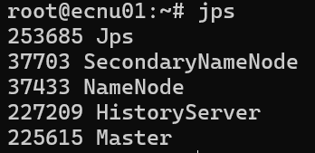

<center>主节点</center>

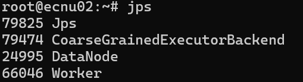

<center>从节点</center>

- **部署Ray集群，设置ecnu01为Head，ecnu02和ecnu03为Worker**

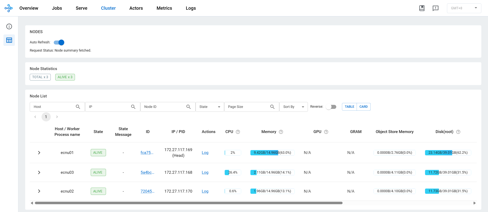

<center>Ray Dashboard</center>


#### 二、数据准备

- **下载并预处理所需数据集，确保数据格式符合实验要求**
- **将数据上传至HDFS，确保Spark和Ray能够访问数据**

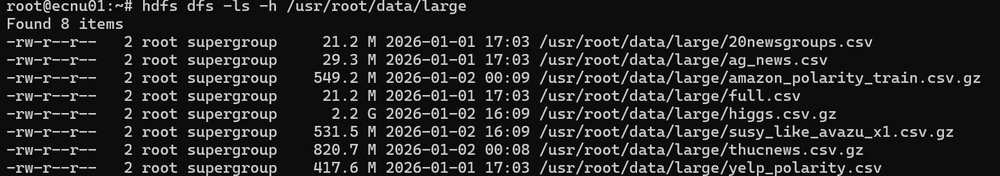


#### 三、实验执行

**我们会在每次测试中多次运行预处理算子**

- **在Spark集群上运行预处理算子，记录执行时间和资源使用情况**

```shell
python -m src.bench.cli run --engine spark --operator OneHotEncoder --input hdfs:////usr/root/data/large/20newsgroups.csv --params '{"drop_last": true, "input_cols": ["category"], "handle_invalid":"keep"}' --io-mode engine --spark-master spark://ecnu01:7077 --spark-driver-host 172.27.117.169 --repeats 10
```

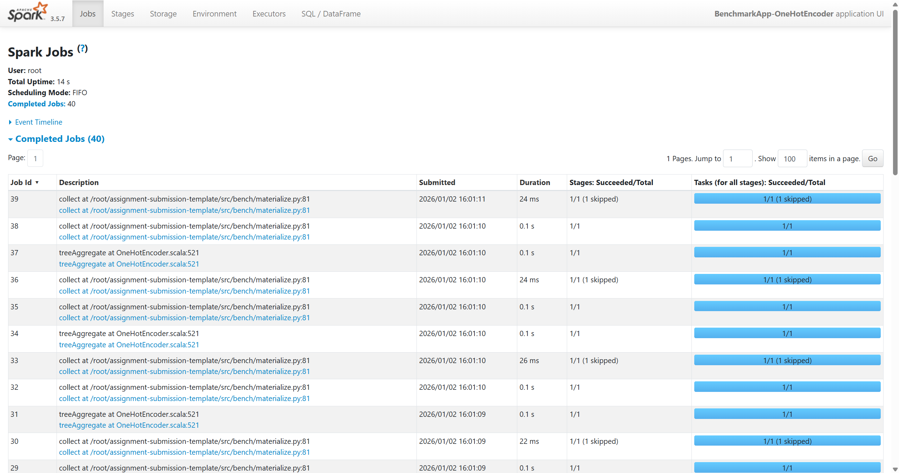

- **在Ray集群上运行相同的预处理算子，记录执行时间和资源使用情况。**

```
python -m src.bench.cli run --engine ray --operator OneHotEncoder --input hdfs://ecnu01:9000/usr/root/data/large/20newsgroups.csv --params '{"input_cols": ["category"], "output_cols": ["category"]}' --io-mode engine --ray-address ecnu01:6379 --repeats 10
```

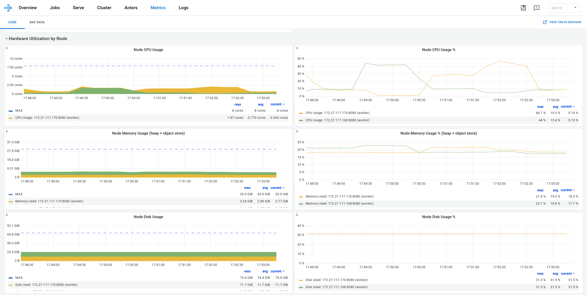


### 实验结果与分析

#### 采集的数据指标
- 端到端运行时间/总时间：从提交作业到结束的总时间，在此期间我们会多次运行算子
- 算子内时间：Spark/Ray面板中报告的算子执行阶段中实际在算子内执行的部分时间
- 例如，对于StandardScaler算子，在Spark中，我们选取包含ObjectHashAggregate和collect结果的Job作为算子内时间，在Ray中，我们同样选取包含HashAggregate和StandardScaler->MapBatches的Dataset级别的时间之和作为算子内时间，下图展示了Spark和Ray一次实验在面板中的时间组成

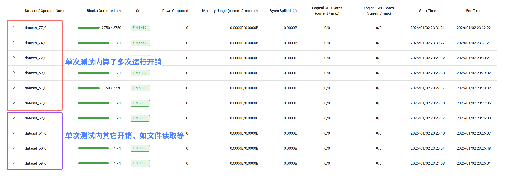

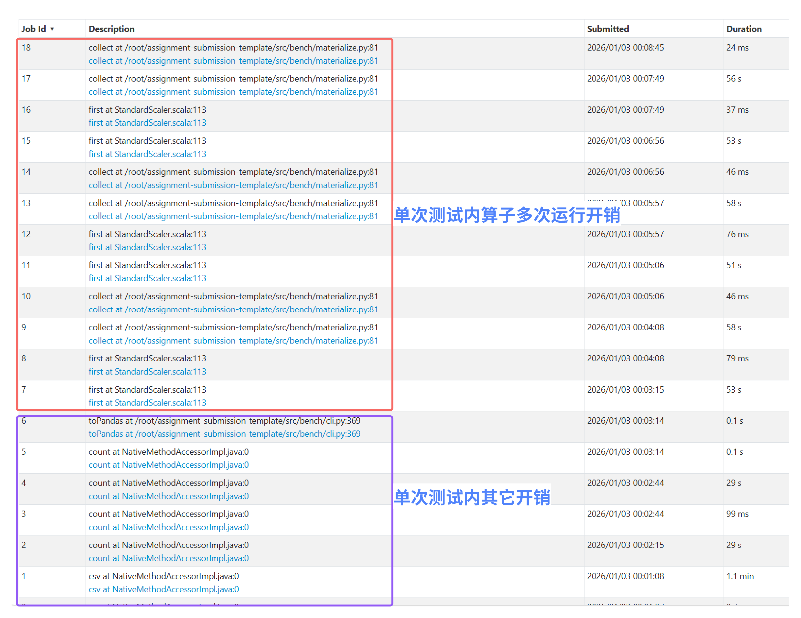

- CPU/RAM使用率：通过Ray-Prometheus获取的机器在过去一段时间内的资源使用率，我们选取集群内所有机器**峰值**的平均值

#### OneHotEncoder：数据集行数的影响

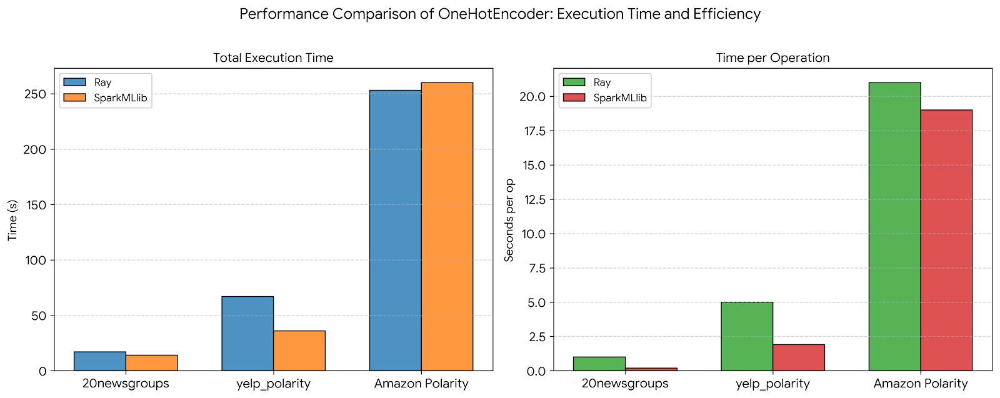

<center>OneHotEncoder 在 Ray 与 Spark MLlib 上的性能对比</center>

我们观察到在小规模数据集上，Spark MLlib显著快于Ray Data中的同类算子，但随着数据集规模的增加，两者相差不大，说明此时达到了其它瓶颈（如网络）

- **Spark MLlib 在小到中等规模数据上的性能优势主要来自其对特征工程算子的高度系统级优化。**

Spark MLlib 的 OneHotEncoder 是原生实现于 JVM 生态中的核心算子，依托 Tungsten 内存管理、向量化执行以及对稀疏向量的专门优化，在执行过程中能够有效减少内存拷贝和对象创建的开销。同时，Spark 采用以 DAG 为核心的批处理执行模型，使得多个 transformation 可以在同一执行计划中被高效调度和融合，避免了频繁的任务调度与进程间通信。相比之下，Ray 需要通过 Python 层进行任务拆分与调度，并依赖 object store 进行数据传递，这些额外的系统开销在数据规模较小时难以被计算本身所掩盖，从而导致 Spark 在小规模和中等规模数据上表现出更低的总执行时间和更快的单次操作速度。

- **在大规模数据场景下，Ray 之所以能够追平甚至略微超过 Spark，主要是因为其并行调度与执行模型在计算主导阶段逐渐显现优势。**

当数据规模扩大到 Amazon Polarity 这类级别时，OneHot 编码本身的计算与内存访问成本成为主要瓶颈，框架层面的调度开销被显著摊薄。Ray 的任务和 Actor 模型允许更细粒度且灵活的并行执行，使得计算资源能够被充分利用，而其分布式对象存储在大数据吞吐场景下也具备良好的扩展性。与此同时，Spark 在处理极高维度、超大规模稀疏特征时，往往会面临更明显的 Shuffle、序列化以及 JVM 垃圾回收压力，从而削弱了其原本在算子级优化上的优势。因此，在超大规模数据条件下，Ray 能够逐步缩小与 Spark 的性能差距，甚至在部分场景中实现略微领先。


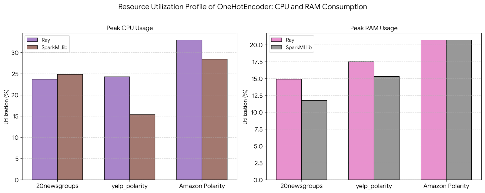

<center>OneHotEncoder 在 Ray 与 Spark MLlib 上的资源使用特征</center>

- **Ray在中、大规模数据上CPU利用率明显更高**

Ray 在 OneHot 编码过程中采用了更细粒度的任务并行模型，会将数据拆分为多个独立的 task 或 actor 并行执行，从系统层面鼓励更积极地“吃满”CPU 资源。因此，在中等和大规模数据集上，Ray 能够同时调度更多计算任务，使得峰值 CPU 使用率显著高于 Spark。这种设计有利于缩短整体 wall-clock time，但代价是单节点或单 executor 上的 CPU 峰值更高。

相比之下，Spark MLlib 的执行模型更偏向批处理与算子融合，虽然整体吞吐率高，但在部分阶段（如等待 Shuffle、内存回收或 Stage 切换）CPU 会出现空闲，从而在监控指标上表现为较低的峰值 CPU 使用率，尤其在 yelp_polarity 这类中等规模任务中更为明显。

- **Ray 在小 / 中规模下内存占用略高，大规模下与 Spark 收敛**

Ray 的内存使用在小到中等规模数据上普遍略高，主要源于其 分布式对象存储和任务间数据传递机制。OneHot 编码过程中，中间结果往往以对象的形式暂存于内存中，这会带来额外的内存占用。而 Spark MLlib 更倾向于在 JVM 内部以紧凑的稀疏向量结构表示中间结果，并通过流水线方式快速消费这些数据，从而在小规模任务中展现出更好的内存效率。

然而，当数据规模上升至 Amazon Polarity 级别时，OneHot 编码本身产生的高维稀疏特征成为内存占用的主导因素，无论是 Ray 还是 Spark，都必须为大规模特征矩阵分配接近的内存空间。因此，两者的峰值内存使用率在大规模数据下趋于一致，框架层面的内存管理差异被数据本身的规模效应所掩盖。

#### 数据集列数的影响：MinMaxScaler和StandardScaler

数据集规模除了数据量（行数）的变化外，数据列数（维度）也会发生变化，我们在Avazu_x1数据集上对处理不同维度的数据（2，8，16）下，Ray Data和 Spark Mllib中 MinMaxScaler与StandardScaler的性能进行了实验和比较。

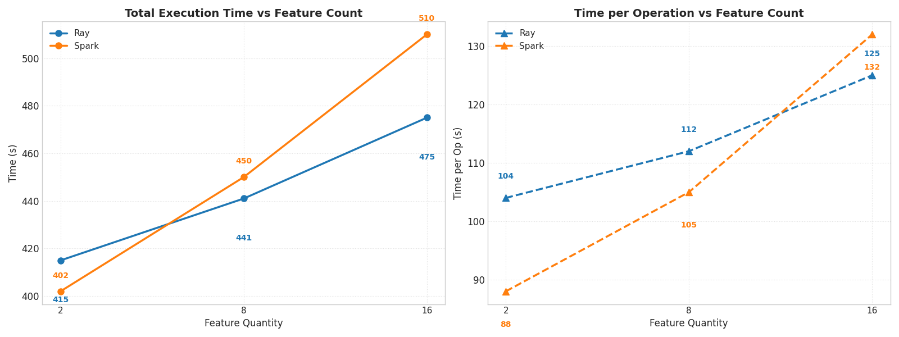

我们可以观察到，在维度较小时，Spark的执行效率要高于Ray，而随着维度的增加，Ray的效率实现了反超。

这是由于Spark Mllib中StandardScaler算子在处理多个列时，需要先通过VectorAssembler进行组装，随着列数的增加，在这一阶段的开销逐渐拖累Spark的算子执行效率。

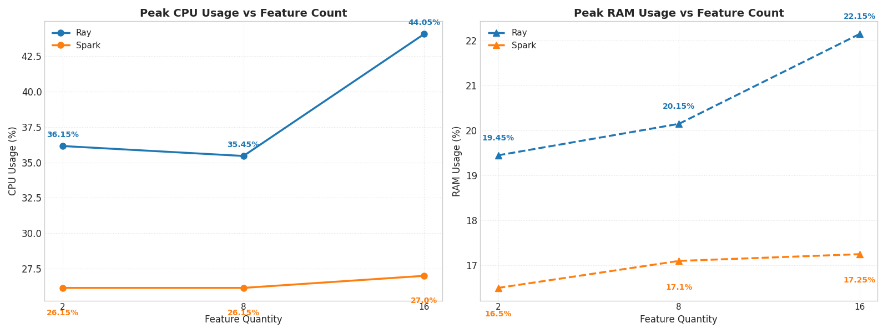

在硬件资源使用上，我们观测到与OneHotEncoder中相似的结果，Ray的CPU和内存占用率都要高于Spark。

上文中的数据来自于对StandardScaler算子的测量，MinMaxScaler与其类似，如下图所示。

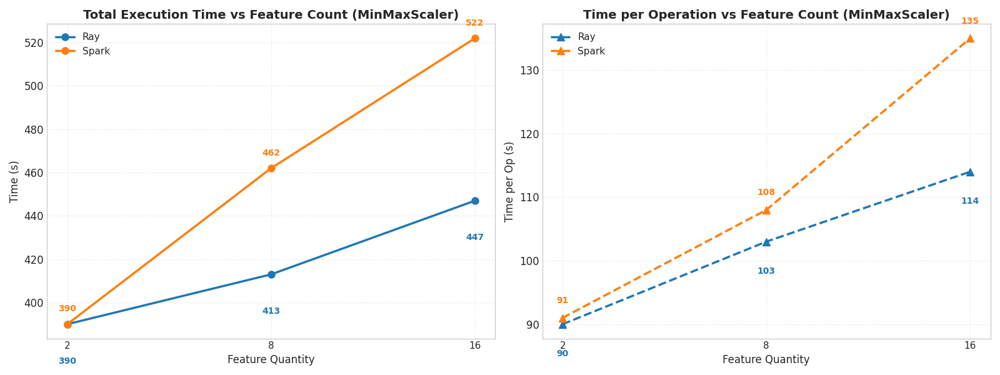
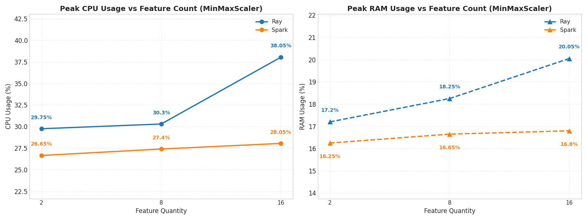
### 结论

| 算子           | Spark MLlib 是否内置   | Ray Data 是否内置                           | 备注                                                         |
| -------------- | ---------------------- | ------------------------------------------- | ------------------------------------------------------------ |
| StandardScaler | 是                     | 是                                          | 固定为$ ((x-\bar{x})/s)$，不提供 `with_mean/with_std` 开关   |
| MinMaxScaler   | 是（支持 `min/max`）   | 是                                          | 固定缩放到 ([0,1])，不支持任意 ([min,max])                   |
| StringIndexer  | 是                     | OrdinalEncoder/LabelEncoder                 | OrdinalEncoder 对“未见值”编码为 NaN，语义与 `error/skip/keep` 不同 |
| OneHotEncoder  | 是                     | 是                                          |                                                              |
| Imputer        | 是（mean/median/mode） | 是（SimpleImputer）                         | 提供 `mean/most_frequent` 等策略，未覆盖 Spark 的 `median` 语义 |
| Tokenizer      | 是                     | 否（通常用 `map_batches` 自写）             |                                                              |
| HashingTF      | 是                     | 否（近似：FeatureHasher/HashingVectorizer） | FeatureHasher 不支持稀疏矩阵                                 |
| IDF            | 是                     | 否                                          |                                                              |

#### Spark MLlib vs Ray Data：扩展算子难易程度讨论

#### 接口与编程语言

##### Spark MLlib：基于 Pipeline 的标准化架构

Spark MLlib 采用统一的 **Estimator-Transformer** 抽象模型，构建了高度规范的算子扩展体系。

* **设计模式**：所有扩展算子必须适配 `fit()` 与 `transform()` 接口，并通过 `Param` 与 `ParamMap` 实现参数的强类型管理。这种设计确保了自定义算子能够无缝集成至 `Pipeline` 流水线中。
* **语言约束**：若追求极致的执行效率，通常需使用 **Scala/Java** 在 JVM 原生侧实现逻辑；若采用 **PySpark** 开发，算子逻辑往往会涉及 Python UDF 的序列化路径，产生跨进程通信开销。

##### Ray Data：基于分布式原语的灵活架构

Ray Data 提供了两条并行的扩展路径，侧重于 Python 生态的工程灵活性。

* **函数式/类扩展**：开发者可通过 `Dataset.map_batches()` 直接定义批处理逻辑。其中，纯函数映射为 **Stateless Tasks**（无状态任务），而类实例则映射为 **Stateful Actors**（有状态参与者）。
* **抽象类扩展**：通过继承 `Preprocessor` 基类实现 `fit/transform` 逻辑。其优势在于支持在转换阶段进行细粒度的资源配置（如显式声明 `num_cpus`、`memory` 或 `concurrency` 等实验性参数）。
* **数据表示**：编程语言深度绑定 **Python**，支持通过 NumPy、pandas 或 Apache Arrow 等高性能批格式优化数据表示。

#### 性能（内置 vs 自写）

- **Spark（自写算子性能特征）**：
  - 使用内置 DataFrame/SQL 表达式时，执行主要在 executor JVM 内完成，通常优于 Python UDF 路径；并且官方与工程实践都强调尽量用内置函数以避免 Python 侧序列化/反序列化开销。
- **Ray（自写算子性能特征）**：
  - `map_batches()` 面向批处理，易通过向量化计算库（如 NumPy/pandas）提升计算吞吐。其 Task/Actor 的执行形态天然适配大规模机器学习的预处理与推理工作负载。

#### 生态成熟度与覆盖面

- **Spark MLlib**：特征工程算子覆盖面更完整且长期稳定，特别是针对文本处理链路的 **Tokenizer / HashingTF / IDF (TF-IDF)** 等组件。
- **Ray Data**：内置 preprocessors 主要覆盖常见的表格类缩放、编码、缺失值处理（如 StandardScaler/MinMaxScaler/OneHotEncoder/SimpleImputer/LabelEncoder/OrdinalEncoder 等）。
  但对 **TF-IDF / IDF** 这类经典文本统计链路，官方生态仍存在“希望提供 preprocessor”的需求讨论，意味着工程上更常见的做法是基于 `map_batches` 或自定义 Preprocessor 自建。

#### Spark MLlib vs Ray Data：算子性能讨论
在小/中规模或低维特征场景下Spark MLlib 更占优，这是因为算子内部开销更低，且 VectorAssembler 开销在低维时较小，端到端更快。而在高维特征场景：Ray 的端到端扩展性更好，其开销随特征数线性增长，Ray 的算子内部开销与总时长增长更平滑；Spark 因为VectorAssembler 等组装成本的原因，开销上升更快，导致性能不如Ray。在处理超大规模数据集时（如 Amazon Polarity），二者之间的差距较小，此时端到端时间更多受系统瓶颈/物化与序列化等影响，框架差异被部分抹平；此时选型可能更多取决于生态、易用性与运维而非纯性能。

### 分工

吴冕志：整体框架搭建，算子实现，算子测试

杭东升：算子实现，算子测试

朱晨雷：服务器环境搭建，算子实现，文档撰写

刘永哲：算子实现，文档撰写
